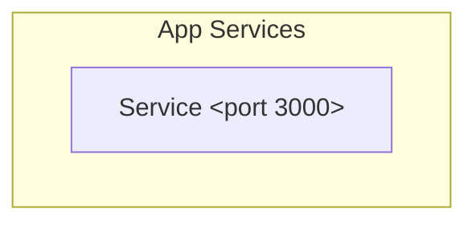

# Architecture Vision (TOGAF Phase A)

> Auto-generated from USM. Source: `.usm/system.usm`

## System Identity

| Field | Value |
|-------|-------|
| Name | template-website |
| Domain | example.com |

## Summary

template-website — system description. Edit this to describe what the system does in 1-3 sentences.

## Services Overview

