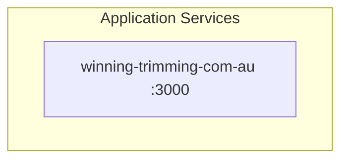

# Application Architecture (TOGAF Phase C2)

> Auto-generated from USM service and feature files.

## Application Service Map

## Per-Service Breakdown

### winning-trimming-com-au

- **Type**: web-app
- **Runtime**: nextjs
- **Port**: 3000

