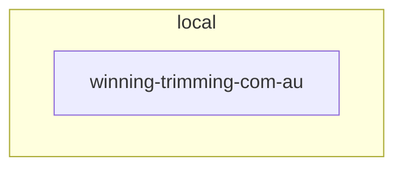

# Technology Architecture (TOGAF Phase D)

> Auto-generated from USM service infrastructure and system.usm.

## System Infrastructure

| Field | Value |
|------|-------|
| Cloud | — |
| Region | — |
| Terraform | — |
| DNS | — |
| SSL | — |

## Deployment Environments

| Name | URL | Type | Notes |
|------|-----|------|-------|
| dev | http://localhost:3000 | local | — |

## Operations

| Field | Value |
|------|-------|

## Per-Service Infrastructure

No services have `infrastructure` data yet. Run `usm scan infrastructure` to populate.

## Technology Stack Overview

